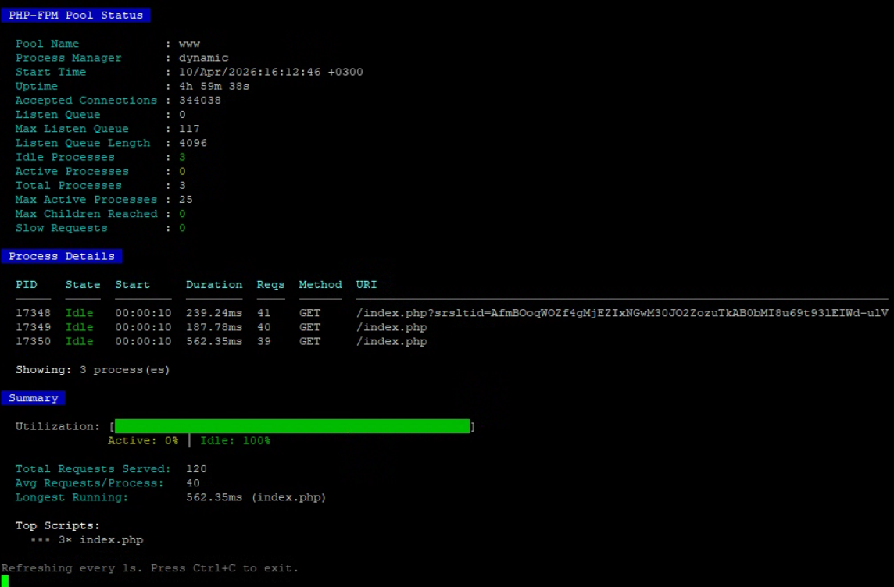

# PHP-FPM Status Parser

A powerful command-line tool to monitor and display PHP-FPM pool status with a beautiful, colorized output. Get real-time insights into your PHP-FPM processes, including pool statistics, scoreboard visualization, and detailed process information.



## Features

- 🔌 **Multiple Connection Methods**: Connect via Unix socket, TCP socket, or HTTP
- 📊 **Real-time Monitoring**: Watch mode with configurable refresh intervals
- 🎨 **Colorized Output**: Easy-to-read, color-coded terminal display
- 📈 **Scoreboard Visualization**: Visual representation of process states
- 🔍 **Filtering & Sorting**: Filter by process state and sort by various fields
- 📝 **JSON Output**: Machine-readable output for scripting and automation
- ⚡ **Direct FastCGI Support**: No web server required for status access

## Requirements

- PHP 8.0 or higher
- PHP-FPM with status page enabled

## Installation

```bash
# Clone the repository
git clone https://github.com/jannoke/monitoring-php-fpm-status.git

# Make the script executable
chmod +x monitoring-php-fpm-status/fpm-status.php
```

## PHP-FPM Configuration

Enable the status page in your PHP-FPM pool configuration (e.g., `/etc/php/8.x/fpm/pool.d/www.conf`):

```ini
pm.status_path = /status
```

Then restart PHP-FPM:

```bash
sudo systemctl restart php-fpm
```

## Usage

```bash
php fpm-status.php [options] <target>
```

### Target (Connection Method)

| Target | Description |
|--------|-------------|
| `/path/to/socket` | Unix socket (direct FastCGI) |
| `host:port` | TCP socket (direct FastCGI, default port: 9000) |
| `http://host/status` | HTTP URL (requires web server proxy) |

### Options

| Option | Description |
|--------|-------------|
| `-h, --help` | Show help message |
| `-w, --watch=N` | Auto-refresh every N seconds (default: 2) |
| `-q, --quiet` | Show only summary statistics |
| `--json` | Output in JSON format |
| `--state=STATE` | Filter processes by state (idle, running, active) |
| `--sort=FIELD` | Sort by: pid, state, duration, requests, script |
| `--status-path=PATH` | FPM status path (default: /status) |
| `--no-color` | Disable colored output |

## Examples

### Connect via Unix Socket (Most Common)

```bash
php fpm-status.php /var/run/php/php-fpm.sock
```

### Connect via TCP Socket

```bash
php fpm-status.php 127.0.0.1:9000
```

### Connect via HTTP

```bash
php fpm-status.php http://localhost/status
```

### Watch Mode - Refresh Every 5 Seconds

```bash
php fpm-status.php -w 5 /var/run/php/php-fpm.sock
```

### Show Only Running Processes, Sorted by Duration

```bash
php fpm-status.php --state=running --sort=duration /var/run/php/php-fpm.sock
```

### JSON Output for Scripting

```bash
php fpm-status.php --json /var/run/php/php-fpm.sock
```

### Quiet Mode - Just the Stats

```bash
php fpm-status.php -q /var/run/php/php-fpm.sock
```

### Custom Status Path

```bash
php fpm-status.php --status-path=/fpm-status 127.0.0.1:9000
```

## Output Information

The tool displays:

- **Pool Information**: Pool name, process manager type, uptime, connection stats
- **Scoreboard**: Visual representation of all process states
- **Process Details**: PID, state, start time, request duration, requests served, method, and URI
- **Summary**: Utilization percentage, total requests, average requests per process, and top scripts

### Process States

| Symbol | State | Color |
|--------|-------|-------|
| `_` `.` `I` | Idle | Green |
| `A` | Active | Yellow |
| `R` | Running | Magenta |
| `D` | Done | Blue |
| `K` | Killing | Red |

## License

MIT License

## Contributing

Contributions are welcome! Please feel free to submit a Pull Request.
